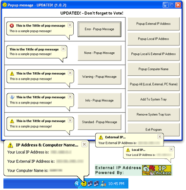



## Popup Balloon \- UPDATED\! \(1\.0\.2\)

### Description

This is another Update of my Popup Balloon!

It Now Supports: Different Icons, Finds Computer Name, External IP, Local IP.. and pops it up in Balloon.

Main Purpose: Sends the program to the system tray and when you click on the command button it will show a popup balloon. - (See Screenshot)
 
### More Info
 

             |
---                |---
**Submitted On**   |2004-10-31 23:10:00
**By**             |
**Level**          |Intermediate
**User Rating**    |4.6 (23 globes from 5 users)
**Compatibility**  |VB 6\.0
**Category**       |[Coding Standards](https://github.com/Planet-Source-Code/PSCIndex/blob/master/ByCategory/coding-standards__1-43.md)
**World**          |[Visual Basic](https://github.com/Planet-Source-Code/PSCIndex/blob/master/ByWorld/visual-basic.md)
**Archive File**   |[Popup\_Ball1812781112004\.zip](https://github.com/Planet-Source-Code/popup-balloon-updated-1-0-2__1-57036/archive/master.zip)

